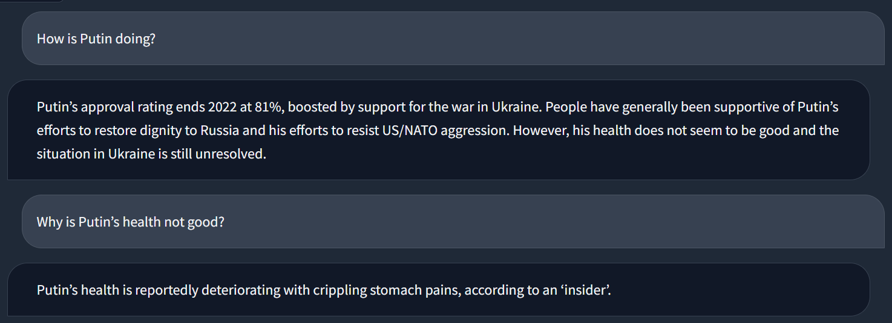

# ask-reddit-gpt

AskRedditGPT is a tool that takes in a query, sends it over to Reddit, and returns an answer based on relevant posts/comments.

## Methodology

1. Take in query $q$ from user.
2. Get $N$ topics from $q$ using GPT.
3. Determine $C$, which is a set of comments concerning $N$ topics and hopefully best-suited to answer $q$.
4. Search $q \in C$ and use GPT to return an all-encompassing answer.

## Overview

The below image is a high-level overview of the project.

## Examples

Example 1:

Example 2:

Example 3:

Example 4:

